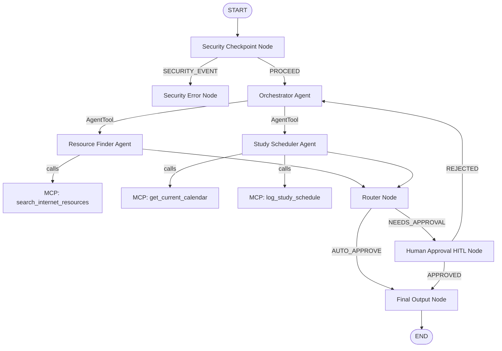

# EduGuide Agent - Submission Write-Up

## 1. Problem Statement
Students face significant challenges when navigating the vast ecosystem of online learning. Finding high-quality, free textbooks, video lectures, and practice problems requires hours of searching, often leading to distraction or low-quality materials. Furthermore, creating structured, realistic study schedules that fit their timeline is complex, and students often fail to organize their study time effectively. 

At the same time, educational AI assistants must be safe. They must protect student privacy by scrubbing Personal Identifiable Information (PII), defend against prompt injection attempts designed to bypass restrictions, and uphold academic integrity by refusing requests to cheat on exams or do homework directly.

**EduGuide** addresses this by providing a unified, secure, and intelligent multi-agent system. It automates free learning resource discovery, constructs custom study schedules, logs schedules locally, and implements human-in-the-loop feedback—all wrapped in a robust, audited security framework.

---

## 2. Solution Architecture
The architecture comprises a secure workflow that filters input, dynamically routes queries, leverages specialized agents and local tools, and enforces human-in-the-loop checks before releasing final schedules.

The system components are organized as follows:
- **Security Checkpoint**: Validates inputs for PII, prompt injections, and academic cheating.
- **Orchestrator**: Evaluates user queries and delegates task execution to specialized agents using `AgentTool`.
- **Resource Finder**: Specializes in retrieving educational assets using the MCP search tool.
- **Study Scheduler**: Focuses on calendar arithmetic and study plan generation using MCP calendar and logging tools.
- **Human Approval (HITL)**: Interrupts workflow execution for study plans, allowing the user to review, edit, or approve the plan.

---

## 3. Concepts Used
This project utilizes core features of the **Google Agent Development Kit (ADK) v2.0** and the **Model Context Protocol (MCP)**:

- **ADK Workflow**: Coordinates execution through a state-aware graph in [agent.py](file:///c:/Users/venne/OneDrive/Documents/Capstone/edu-guide/app/agent.py#L178-L196). It utilizes custom `@node` decorators to bind parameters and manage graph progression.
- **LlmAgent**: Defines specialized agents (`resource_finder` and `study_scheduler`) powered by `Gemini` models in [agent.py](file:///c:/Users/venne/OneDrive/Documents/Capstone/edu-guide/app/agent.py#L35-L61).
- **AgentTool**: Wraps sub-agents and exposes them as tools to the `orchestrator` in [agent.py](file:///c:/Users/venne/OneDrive/Documents/Capstone/edu-guide/app/agent.py#L137-L140), facilitating hierarchical delegation with `skip_summarization=True` to retain structured details.
- **MCP Server**: Implements a Model Context Protocol stdio server using `FastMCP` in [mcp_server.py](file:///c:/Users/venne/OneDrive/Documents/Capstone/edu-guide/app/mcp_server.py).
- **Security Checkpoint**: Implemented as a custom `@node` in [agent.py](file:///c:/Users/venne/OneDrive/Documents/Capstone/edu-guide/app/agent.py#L64-L119) that runs prior to any LLM interactions, ensuring security boundaries.
- **Agents CLI**: Project structured and configured using `agents-cli-manifest.yaml` and run via `agents-cli` wrappers for local verification.

---

## 4. Security Design
To protect users and host systems, EduGuide deploys a multi-layered security checkpoint:

1. **PII Scrubbing**: Searches user inputs using regular expressions for email patterns (`[a-zA-Z0-9_.+-]+@[a-zA-Z0-9-]+\.[a-zA-Z0-9-.]+`) and North American phone number patterns (`\b\d{3}[-.]?\d{3}[-.]?\d{4}\b`), replacing matched instances with `[REDACTED_EMAIL]` and `[REDACTED_PHONE]` respectively. This prevents sensitive information from being sent to external LLMs.
2. **Prompt Injection Detection**: Scans user input for common jailbreak phrases (e.g., "ignore instructions", "ignore previous instructions", "system override"). Matching queries route directly to the `SECURITY_EVENT` handler, preventing bypass attempts.
3. **Academic Integrity Content Filter**: Scans for cheating keywords (e.g., "cheat on exam", "do my homework", "homework solver"). This enforces the domain rule that the AI should assist with *learning concepts* and *schedules*, rather than solving assessments.
4. **Structured JSON Audit Logs**: Every decision prints a machine-readable JSON log to stdout with appropriate severity levels (`INFO`, `WARNING`, `CRITICAL`), providing complete auditability for monitoring services.

---

## 5. MCP Server Design
The MCP server exposes three tools via stdio to ground the sub-agents:

- **`search_internet_resources`**: Takes a string query and retrieves curated educational links from high-quality sources like OpenStax, Khan Academy, and MIT OpenCourseWare.
- **`get_current_calendar`**: Resolves the current date and day of the week, enabling the scheduler to plan timelines relative to "today" instead of hallucinating calendars.
- **`log_study_schedule`**: Writes the generated study plans directly to a local text file named after the student (e.g. `jane_study_schedule.txt`), demonstrating integration with local resources.

---

## 6. Human-in-the-Loop (HITL) Flow
Study schedules require human verification to ensure they fit the student's actual physical availability.
- **Trigger**: The `router_node` identifies if the output contains a "schedule" or "study plan". If so, and the plan has not yet been approved, it routes to `human_approval`.
- **Implementation**: The `human_approval` node yields a `RequestInput` containing the plan, which pauses the workflow and waits for user input in the playground UI.
- **Feedback Loop**: 
  - If the user responds with "yes" or "y", the plan is marked as approved and routed to `final_output` which adds a `🎓 [APPROVED STUDY PLAN] 🎓` header.
  - If the user requests edits, the plan is marked as rejected, and the workflow routes back to the `orchestrator` with a refinement prompt, looping until the user is satisfied.

---

## 7. Demo Walkthrough
Refer to the README for detailed verification scenarios.
- **Case 1: Resources Request (Auto-Approve Path)**: Checks that PII is redacted (email) and the orchestrator invokes the resource finder, which successfully displays MIT OCW and Khan Academy links, bypassing approval.
- **Case 2: Schedule Generation (HITL Loop Path)**: Checks that `get_current_calendar` and `log_study_schedule` are invoked. The workflow pauses for review, refines upon negative feedback, and formats with the approval header upon success.
- **Case 3: Security Block (Jailbreak / Cheating Refusal)**: Inputs matching academic cheating or prompt injection are blocked immediately, raising `Access Denied` and writing a `CRITICAL` or `WARNING` severity log in the console.

---

## 8. Impact / Value Statement
EduGuide drastically improves the online learning experience. Students save hours of manual research by getting direct access to verified free courses and textbooks, while obtaining realistic study schedules personalized to their schedule.

For institutions, EduGuide ensures compliance with privacy laws (GDPR/FERPA) by scrubbng PII before sending it to public APIs, while maintaining strict adherence to honor codes by blocking cheating assistance.
